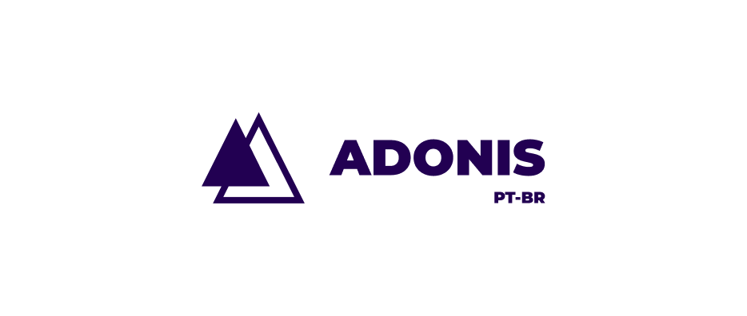

# Introdução 👋

Bem-vindo!

Esse é um projeto independente para tentar pegar o máximo possível da documentação e essencial da [documentação oficial do AdonisJS](https://adonisjs.com).

Começamos com a parte mais simples, os [fundamentos](./docs/fundamentos/).

Disclaimer: Recomendo você sempre ler a documentação oficial.

## Contribuição 🤝

`<PR>`. Caso você queria ajudar no projeto, com algum conhecimento ou algo para adicioná-lo. Você pode enviar um PR para esse repositório que estaremos analisando. 🤠

`<Issue>`. Caso encontre algum erro, pode participar de alguma sessão das [Issues](https://github.com/Greens-Organization/AdonisPT-BR/issues) deste repositório. 😀

## Participações 🤝

Esse repo é mantido pelos seguintes [participante(s)](https://github.com/Greens-Organization/AdonisPT-BR/graphs/contributors)

|  |
| ----------------------------------------------------------------------------------------------- |
| [Alpha Vylly](https://github.com/AlphaLawless) |

## Licença 📝

[MIT License](./LICENSE)